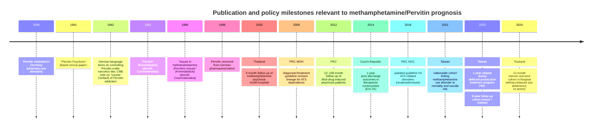

# Non-English Follow-up Literature on Long‑Term Recovery Prognosis After Methamphetamine/Pervitin Use

## Executive summary

Across the prioritized languages, there **is** non‑English literature that speaks to “long‑term prognosis” after methamphetamine (including historical “Pervitin”) use, but the evidence base is uneven by language and outcome domain. Czech/Slovak sources are strongest on *social/identity recovery narratives* and on *1‑year post‑treatment outcomes* from therapeutic communities, while Mainland Chinese sources include an unusually long *8‑year follow‑up* cohort after compulsory detoxification. Thai sources contain multiple *structured follow‑ups* (6–12 months) in clinical and health‑service settings, and Taiwanese sources include both (a) *1‑year relapse during a deferred‑prosecution treatment program* and (b) a large national record‑linkage cohort quantifying *mortality and suicide risk* among people with methamphetamine use disorder. citeturn27view0turn6view1turn5view2turn12view0turn25view0turn32search0

However, **true 5+ year clinical recovery cohorts** (abstinence stability, cognitive recovery, functioning) in local languages appear rare outside Mainland China; many studies cluster around **6–12 months**. Czech has a notable *≥5‑year qualitative* “self‑change” study, but it is not a clinical cohort and is likely subject to “successful quitter” selection. citeturn27view0turn5view2

For German/Swiss sources (1940s–1980s), there **are identifiable clinical-era publications** on Pervitin psychosis and on “course” (*Verlauf*) of Pervitin addiction, but much of it is **paywalled or archive‑only** and rarely indexed as “recovery prognosis” in modern terms. A key WWII‑era clinical paper (*Pervitin‑Psychose*, Basel) is clearly identifiable (with DOI) but is typically access‑restricted; an additional 1942 continuing‑education item explicitly references “causes and course” of Pervitin addiction in its title but is usually not digitally available. citeturn30view1turn30view0

## Search strategy and language-specific search terms

### Scope and inclusion logic
The search prioritized **primary studies** (cohort, record‑linkage, follow‑up outcome studies), **official reports/guidelines** that include follow‑up frameworks or outcome reporting, and **local-language addiction/psychiatry journals**. “Long‑term” was treated pragmatically: **5+ years** when available; otherwise, the longest accessible follow‑up intervals were included, and clearly labeled as “closest available.” citeturn5view2turn12view0turn32search0

### Practical constraints affecting “older” archives
Several target repositories either (a) hold relevant periodicals but restrict public viewing, or (b) are technically inaccessible during retrieval. For example, the entity["organization","Kramerius (NLK)","digital library platform cz"] interface for *Československá psychiatrie* indicates some content is “not publicly accessible,” implying institutional login or on‑site access may be required. citeturn10view0

### Suggested search terms used (and recommended) in original languages

**Czech (cs) / Slovak (sk)**
- “pervitin” + (“sledování” / “katamnéza” / “katamnestická studie” / “výsledky léčby” / “po léčbě” / “1 rok”)  
- “metamfetamin” + (“abstinence” / “relaps” / “sociální fungování” / “kvalita života”)  
- “toxikoman*” + (“katamnéza” / “sledování”)  
Examples of hard-to-find communist‑era bibliographic targets include *Kriminalistický sborník* items explicitly titled “Pervitin” or “Problematika zneužívání metamfetaminu (Pervitinu).” citeturn9search2turn8search0turn8search5

**Chinese (Mainland; zh‑CN)**
- 甲基苯丙胺 +（随访 / 长期随访 / 预后 / 转归 / 复吸 / 戒断 / 康复 / 社会功能 / 认知功能）  
- 强制隔离戒毒 +（随访 / 复吸率）  
These terms surfaced an 8‑year follow‑up cohort in a Chinese psychiatry journal and official guideline lineages (2002 → 2009 revision → 2018 revision/renaming). citeturn5view2turn7search2turn7search0

**Chinese (Taiwan; zh‑TW)**
- 甲基安非他命 +（追蹤 / 隨訪 / 復發 / 戒癮治療 / 緩起訴附命戒癮治療 / 再犯率）  
This surfaced Taiwanese programmatic follow‑up statistics (e.g., 1‑year relapse during a deferred‑prosecution medical program) and large-scale linked administrative cohort outcomes (mortality and suicide). citeturn25view0turn32search0

**Thai (th)**
- เมทแอมเฟตามีน / ยาบ้า + (ติดตามผล / ผลการรักษา / กลับป่วยซ้ำ / เสพซ้ำ / 12 เดือน / 1 ปี / โรคจิต)  
This identified follow‑ups in a national mental health research abstract database, a Thai nursing journal with 12‑month outcomes, and hospital evaluation reports referencing 3‑month and 1‑year follow‑up structures. citeturn12view0turn31view0turn19view2

**German (de) / Swiss German-language indexing**
- “Pervitin” + (“Psychose” / “Pervitin‑Psychose” / “Sucht” / “Verlauf” / “Prognose” / “Katamnese”)  
This identified key WWII‑era clinical publications and bibliographic traces referring explicitly to “causes and course” of Pervitin addiction. citeturn30view1turn30view0turn29search3

## Comparative table of key studies and reports

The table below emphasizes **follow-up outcomes** and **prognosis-relevant endpoints**. Items with “archive-only” access are retained when they are clearly identifiable in reputable bibliographic sources but not retrievable as full text during this search.

| Language | Country / setting | Full citation (original title → English translation; transliteration where relevant) | Study type | N | Follow-up interval(s) | Outcome measures captured | Era context | Access |
|---|---|---|---|---:|---|---|---|---|
| Czech | Czech Republic | entity["people","Petr Nepustil","czech researcher"] (2009). *Jde to i bez léčby: proces transformace identity po ukončení dlouhodobého užívání stimulancií* → “It works without treatment: identity transformation after quitting long-term stimulant use.” *entity["organization","Adiktologie","czech addiction journal"]* (Suppl., 2009/9). citeturn27view0 | Qualitative (narrative interviews; “self-change” cohort definition) | 20 | Retrospective inclusion required ≥5 years since quitting; interviews conducted once | Recovery narrative/identity change; implied sustained non‑use (self‑reported; selection requires “successful” outcome) | Post‑1990 | **Full text PDF available online** citeturn27view0 |
| Czech | Czech Republic | entity["people","Martin Šefránek","czech addiction researcher"] (2014). *Evaluace výsledků léčby v terapeutických komunitách pro léčbu závislostí* → “Evaluation of treatment outcomes in therapeutic communities for addictions.” (Multi‑site EVLTK study; 1‑year post‑treatment outcomes). citeturn6view1turn26search1 | Prospective multi‑site treatment outcome cohort | 176 (baseline), 137 (1‑year follow‑up) | 12 months after discharge | Substance use incl. methamphetamine; risk behavior; physical/mental health; personal/social functioning; quality of life; survival/retention analyses reported | Post‑1990 (data collected 2007–2008 per report) | **Full text PDF available online** citeturn6view1turn26search1 |
| Czech | Czechoslovakia | entity["people","Jarmila Večerková","czech author"] (1986). *Problematika zneužívání methamphetaminu (Pervitinu)* → “Issues in methamphetamine (Pervitin) misuse.” *Kriminalistický sborník* 30(7), 420–428. citeturn8search5turn8search0 | Descriptive / practice-oriented (law‑enforcement/forensic context; outcome focus unclear from accessible metadata) | — | — | Likely patterns/harms/control; prognosis/follow‑up not confirmed in accessible record | **Communist‑era (pre‑1989)** | **Archive/library record located; full text not found online** citeturn8search5 |
| Czech | Czechoslovakia | entity["people","J. Vidrna","czech author"]; entity["people","J. Mikl","czech author"] (1983). *Pervitin* → “Pervitin.” *Kriminalistický sborník* 27(3), 149–155. citeturn9search2 | Descriptive / practice-oriented (bibliographic trace) | — | — | Prognosis/follow‑up content not verifiable from available excerpt | **Communist‑era (pre‑1989)** | **Cited in later academic work; full text not found online** citeturn9search2 |
| Simplified Chinese | PRC (Mainland China) | entity["people","Long Yan","prc author"]; entity["people","Li Ruihua","prc author"]; entity["people","Wei Yicheng","prc author"]; entity["people","Chen Tianzhen","prc author"]; entity["people","Du Jiang","prc author"] (2023). *甲基苯丙胺依赖者情绪状态的长程变化及影响因素：一项8年随访调查* → “Long-term changes in emotional state among methamphetamine dependents and influencing factors: an 8‑year follow‑up.” *entity["organization","国际精神病学杂志","journal of international psychiatry cn"]* 50(6):1383–1385. citeturn5view2turn3view0 | Longitudinal cohort follow‑up | 574 enrolled; 283 completed baseline+8‑year follow‑up | 8 years after baseline (participants recruited 2012–2013; follow-up ~8 years later) | Depression/anxiety status change; regression predictors; relapse (复吸) rate reported | Post‑1990 | **Full text PDF available online** citeturn5view2 |
| English (PRC authors; PRC setting) | PRC (Mainland China) | entity["people","Xia Deng","psychiatry researcher"]; entity["people","Zhongan Huang","psychiatry researcher"]; entity["people","Xiaoqian Li","psychiatry researcher"]; entity["people","Yifeng Li","psychiatry researcher"]; entity["people","Dongfang Wang","psychiatry researcher"]; entity["people","Ying Zhang","psychiatry researcher"] (2012). “Long-term follow-up of patients treated for psychotic disorders induced by illicit drug use.” *entity["organization","Shanghai Archives of Psychiatry","psychiatry journal shanghai"]* 24(4): 201–207. doi:10.3969/j.issn.1002-0829.2012.04.003. citeturn4view1 | Retrospective cohort with long follow-up | 258 identified; 189 completed follow‑up | 13–108 months | Relapse to drug use; persistence/recurrence of psychotic symptoms; clinical course post-discharge | Post‑1990 | **Full text available via entity["organization","PubMed Central","nih open repository"]/entity["organization","PubMed","nih literature database"]** citeturn4view1 |
| Thai | Thailand | entity["people","Suwat Mahatnirunkul","thai psychiatrist"] (2546/2003). *การติดตามผลการดำเนินโรคของโรคจิตจากเมทแอมเฟตามีน 6 เดือน และปัจจัยเสี่ยงในการกลับป่วยซ้ำ* → “Six‑month follow‑up of methamphetamine psychosis and risk factors for relapse.” Presented at 2nd International Conference “Mental Health and Drugs,” Bangkok, 19–21 Aug 2546; p.225. citeturn12view0turn12view2 | Prospective follow‑up (multi‑hospital) | 97 | Monthly follow‑up for 6 months | BPRS/CGI; urine meth tests; psychosis course categories (remission/relapse/persistence); hazard ratio for relapse associated with resumed use | Post‑1990 | **Abstract record online; no downloadable full paper** citeturn12view2 |
| Thai | Thailand | entity["people","Woralug Sriwilai","thai nurse researcher"]; entity["people","Teepatad Chintapanyakun","thai nurse researcher"] (2567/2024). *ผลลัพธ์ของกระบวนการบําบัดผู้ป่วยที่เสพสารแอมเฟตามีนในร่างกาย โรงพยาบาลด่านช้าง* → “Effects of therapeutic process among patients with amphetamine at Danchang Hospital.” *JHNUBU* Vol.3 No.1 (Jan–Jun 2024). citeturn31view0turn15view0 | Retrospective service-outcome cohort | 187 | 3 months and 12 months | Intended cessation; mental complications; follow‑up status: reduced use / abstinent / re‑arrested / psychiatric outcomes | Post‑1990 | **Full text PDF available online** citeturn31view0 |
| Thai | Thailand | entity["people","Monrudee Wongjittarat","thai physician"] (2023). *ปัจจัยทำนายความสำเร็จในการหยุดใช้เมทแอมเฟตามีนระหว่างเข้ารับการบริการเมทริกซ์โปรแกรม* → “Predictors of successful methamphetamine cessation during Matrix program care.” *J Ment Health Thai* 31(3):176–189. citeturn20view0turn20view1 | Exploratory retrospective cohort | 336 | 1 year after completing outpatient psychosocial program | Verified cessation during program; 1‑year post‑program cessation proportion; predictors (e.g., completion; other substance use) | Post‑1990 | **Metadata & abstract open; PDF download rate‑limited at time of retrieval** citeturn15view2turn20view1 |
| Thai | Thailand | entity["people","Narissara Ngamkhajornwiwat","thai researcher"]; entity["people","Sunthornphot Chuachuy","thai researcher"]; entity["people","Supisporn Kaewchuen","thai researcher"] (2563/2020). *การประเมิน… (Matrix Program) โรงพยาบาลธัญญารักษ์ปัตตานี ปีงบประมาณ 2562–2563* → “Technology assessment of Matrix program in Thanyarak Pattani Hospital, 2019–2020.” citeturn15view3turn19view0turn19view2 | Program evaluation report (CIPP framework); follow‑up metrics described | Mixed (includes small documented follow‑up subsample) | 3‑month and “up to 1 year / 4 follow-ups” indicators in report | Relapse after 3 months; follow‑up retention; relapse substance ranking; functioning indicators (work/family support); quality‑of‑life scoring (small n) | Post‑1990 | **Full text PDF available online** citeturn15view3turn19view2 |
| Traditional Chinese | Taiwan | entity["people","Peng Shengxuan","taiwan physician"] (112/2023). entity["organization","臺北市立聯合醫院","taipei, taiwan"] press release (Songde Branch): *甲基安非他命緩起訴附命戒癮治療有效降低復發風險與復發因子之探討* → “Deferred‑prosecution addiction treatment for methamphetamine: relapse risk and predictors.” (Press release cites underlying peer‑reviewed paper DOI: 10.1016/j.jsat.2023.208955.) citeturn25view0 | Program cohort summary (during treatment year) | 449 | Within 1 year (during treatment) | Relapse during treatment; dropout; relapse risk factors (craving; initial urine positivity) | Post‑1990 | **Full text (press release PDF) available online; underlying journal paper may be paywalled** citeturn25view0 |
| English (Taiwan setting) | Taiwan | entity["people","Wan-Chen Lee","taiwan epidemiologist"]; entity["people","Hu-Ming Chang","taiwan researcher"]; entity["people","Ming-Chyi Huang","taiwan psychiatrist"]; entity["people","Chian-Huei Pan","taiwan researcher"]; entity["people","Su-Su Su","taiwan researcher"]; entity["people","Shih-Yin Tsai","taiwan researcher"]; entity["people","Chih-Cheng Chen","taiwan researcher"]; entity["people","Chian-Jue Kuo","taiwan psychiatrist"] (2021). “All-cause and suicide mortality among people with methamphetamine use disorder: a nationwide cohort study in Taiwan.” *Addiction* 116(11):3127–3138. doi:10.1111/add.15501. citeturn32search0turn32search4 | Nationwide record‑linkage cohort | 23,248 (MUD cohort) | Follow‑up via mortality linkage (study period described in abstract); outcome is death | SMR for all‑cause and cause‑specific mortality (suicide, neurological disease, etc.) | Post‑1990 | **Abstract on PubMed; journal access may be paywalled depending on institution** citeturn32search0turn32search4 |
| German (Swiss clinical setting) | Switzerland (Basel) | entity["people","J. E. Staehelin","basel psychiatrist"] (1941). *Pervitin‑Psychose* → “Pervitin psychosis.” *Zeitschrift für die gesamte Neurologie und Psychiatrie* 173:598–620. doi:10.1007/BF02871636. citeturn30view1 | Clinical case series / descriptive psychopathology | — | — | Prognosis/follow‑up details unknown without full text; historically central for acute harms | **WWII era** | **Paywalled/limited access (Springer record located)** citeturn30view2 |
| German (bibliographic trace) | Germany / German-language medical education | entity["people","F. Nau","german physician"] (1942). *Kritische Bemerkungen über Ursachen, Verlauf und Bekämpfung der Pervitin- und Dolantinsucht* → “Critical remarks on causes, course, and control of Pervitin and Dolantin addiction.” *Jahreskurse für ärztliche Fortbildung* 33(2):33–34 (as indexed in UNODC historical bibliography). citeturn30view0 | Continuing-medical-education review (title signals “course/prognosis”) | — | — | Explicitly framed around “course” (Verlauf); likely contains prognosis claims but requires archive retrieval | **WWII era** | **Archive-only likely; located via secondary bibliography** citeturn30view0 |

## Cross-language synthesis of long-term outcomes

### Relapse, abstinence, and re‑use patterns
A recurring theme across Mainland China, Thailand, and Taiwan is that **relapse/re‑use is common** and strongly tied to program retention and early warning markers.

In the Mainland Chinese 8‑year follow‑up cohort after compulsory detoxification, the study reports an extremely high **relapse (“复吸”) proportion**, while also documenting changes in mood states (depression/anxiety) between baseline and follow‑up. Interpretively, it highlights that “long-term follow-up” may capture **partial psychological improvement despite continued high re‑use**, complicating a simple abstinence-only prognosis model. citeturn5view2turn3view0

Thai service‑outcome data from Danchang Hospital (2020–2022 intake) provide a pragmatic 12‑month picture: outcomes are distributed across **reduced use**, **abstinence**, and **re‑arrest**, with parallel recording of mental complications. These outcomes reflect “real‑world functioning” endpoints (including justice involvement) that often go unmeasured in controlled trials. citeturn31view0turn15view0

Taiwan’s Songde Branch deferred‑prosecution collaboration reports a 1‑year relapse proportion during treatment and emphasizes clinically actionable predictors such as **high craving** and **early urine positivity**, suggesting a risk‑stratified follow‑up model. citeturn25view0

### Psychosis course and psychiatric recovery trajectories
Thai and Mainland Chinese sources provide explicit **course-of-psychosis** phenotypes rather than only “abstinent vs not.”

The Thai multi‑hospital 6‑month prospective follow‑up partitions outcomes into **psychosis remission**, **psychosis relapse**, and **psychosis persistence**, and quantifies the increased hazard of psychosis relapse associated with renewed methamphetamine use. citeturn12view0turn12view2

In Mainland China, the long follow‑up (13–108 months) of patients hospitalized for illicit‑drug‑induced psychosis provides a longer window into psychiatric course, combining symptom outcomes with relapse to drug use. The study’s availability via PubMed Central makes it unusually accessible for a “long follow-up psychosis prognosis” dataset in this topic area. citeturn4view1

### Social and occupational functioning as prognosis endpoints
Czech and Thai sources are particularly useful for prognosis elements beyond symptom checklists.

The Czech EVLTK therapeutic community outcome evaluation is explicitly designed to assess not only substance use but also **personal/social functioning and quality of life** one year after discharge (reflecting the therapeutic‑community premise that recovery is broader than abstinence). citeturn6view1turn26search1

Thai hospital evaluations and cohort reports often record **employment/role functioning** indicators and follow‑up attendance/retention—important pragmatic signals of stabilization (or fragility) over time, even when contact declines at later follow‑up points. citeturn19view2turn31view0

### Mortality as an ultimate long-term outcome
Among the located sources, Taiwan provides the clearest large‑scale evidence on **mortality and suicide** among people with methamphetamine use disorder, via nationwide record linkage. The cohort reports markedly elevated standardized mortality ratios (SMRs), with suicide among the highest. This addresses “long‑term prognosis” in the strict sense of survival, albeit not necessarily recovery in functioning. citeturn32search0turn32search4

## Evidence map, gaps, and where to look next

### Evidence map by language and outcome domain
The matrix below summarizes where each language cluster contributes most strongly, based on retrievable sources.

| Outcome domain | Czech/Slovak | PRC (Mainland China) | Thai | Taiwan | German/Swiss (historical) |
|---|---|---|---|---|---|
| ≥5‑year follow-up of users | Qualitative ≥5y “self‑change” study citeturn27view0 | 8‑year cohort citeturn5view2 | Not located in Thai-language clinical cohorts in this search | Mortality cohort (long-term via linkage) citeturn32search0 | Likely exists in fragments; key WWII clinical paper identifiable citeturn30view1 |
| 6–12 month relapse/abstinence | Strong (TC outcomes at 1y) citeturn6view1 | Present but dominated by institutional settings (e.g., compulsory detox follow-up) citeturn5view2 | Strong (hospital/DMH cohorts, 6–12m) citeturn12view0turn31view0 | Strong in specific programs (1y relapse in deferred‑prosecution) citeturn25view0 | Not confirmed |
| Psychosis course | Not a primary focus in located Czech follow-ups | Long follow-up after hospitalization citeturn4view1 | Structured psychosis course follow-up citeturn12view0 | Program/mortality focus in located sources | Early “Pervitin psychosis” clinical focus citeturn30view1 |
| Social/occupational outcomes | Explicitly included in TC outcomes; identity-focused recovery narratives citeturn6view1turn27view0 | Less prominent in located cohort compared with mood/relapse | Often includes real-world indicators (re‑arrest, work) citeturn31view0 | Limited in retrieved items; more justice/health administrative | Not confirmed |
| Cognitive recovery | Not central in located Czech long-term sources | Not central in located 8‑year paper (mood focus) citeturn5view2 | Not central in located Thai follow-ups | Not central in retrieved cohort abstracts | Not confirmed |

### Major gaps identified
A consistent gap across languages is the scarcity of **longitudinal neurocognitive recovery studies** (multi‑year) in local languages. The most “long‑term” accessible work tends to measure (a) relapse/reuse, (b) psychosis course, or (c) mortality, rather than detailed cognitive batteries and occupational trajectories. citeturn5view2turn4view1turn32search0

For Czech/Slovak communist‑era literature, bibliographic traces confirm that Pervitin was discussed explicitly in the 1980s, but **digital full texts** and **clearly prognosis‑anchored follow‑up cohorts** are hard to retrieve online and may require library access. citeturn8search5turn9search2turn10view0

For German/Swiss WWII‑to‑postwar sources, core clinical-era items are identifiable, but systematic long-term recovery prognosis (in modern outcome terms) is not easily retrieved as open text, and some items may only exist as short continuing‑education pieces or within older periodicals. citeturn30view0turn30view1turn29search3

### Likely archival locations and recommended next steps
For hard-to-find documents, the most realistic retrieval path is **library-mediated access**, rather than web search alone.

- **Czech/Slovak (pre‑1989 / communist-era)**:  
  Use entity["organization","Národní lékařská knihovna","prague, czechia"] holdings and its Kramerius interface for *Československá psychiatrie*, but expect restricted access for some volumes/issues (institution login or physical library). citeturn10view0turn9search1  
  For *Kriminalistický sborník* items (1983, 1986), pursue interlibrary loan and specialized police/forensic academy libraries; bibliographic confirmation exists via catalog listings even when PDFs are absent. citeturn8search5turn9search2

- **Mainland China**:  
  For additional long‑follow‑up cohorts (especially “随访/转归/社会功能/认知功能”), a practical next step is institutional access to entity["organization","CNKI (中国知网)","chinese academic database"] / CJFD and parallel databases (Wanfang/VIP). The national guideline lineages (2002 → 2009 revision → 2018 revision/renaming) also suggest searching within government circulars and attachments, not only journals. citeturn7search2turn7search0  
  The located 8‑year follow‑up cohort offers seed references (e.g., institutional setting, follow‑up methods) that can be used to “citation‑chase” within CNKI for similarly structured follow-ups. citeturn5view2

- **Thailand**:  
  The entity["organization","Department of Mental Health (Thailand)","nonthaburi, thailand"] research abstract database is a useful starting index for follow‑up studies, but some entries lack downloadable full texts—plan for direct author/institution contact when only conference abstracts are indexed. citeturn12view2turn12view0  
  ThaiJO-hosted journals and hospital evaluation repositories (e.g., Thanyarak hospital networks) provide downloadable PDFs for medium-term follow‑ups (3–12 months) and program monitoring. citeturn31view0turn15view3  
  If specific ONCB/NCTC PDFs time out in a browser context, request them via official archive channels or search for mirrored copies through university repositories; the topic appears to be maintained in government knowledge portals even if technical stability varies. citeturn17search1turn12view2

- **Germany/Switzerland (1940s–1980s)**:  
  Use SpringerLink for identifiable items such as the Basel “Pervitin psychosis” paper (DOI present), and then pursue institutional access or interlibrary loan for full text and any prognosis statements inside. citeturn30view1turn30view2  
  For short WWII‑era continuing‑education pieces (e.g., “course”/Verlauf of Pervitin addiction), the UNODC historical bibliography entry provides a precise citation target that can be requested from major medical libraries. citeturn30view0  
  To triangulate regulatory milestones, UNODC historical bulletin bibliographies also point to German-language items explicitly about bringing Pervitin under narcotics legislation—use these to anchor archival searches in German medical weeklies and professional bulletins. citeturn29search3turn30view0

## Timeline of notable publications and regulatory milestones

The timeline below combines (a) key follow-up/outcome publications located in Czech/Chinese/Thai/Taiwan sources, and (b) German/Swiss historical milestones identifiable through major bibliographies and archival journal records. citeturn30view1turn30view0turn9search2turn8search5turn28search2turn12view2turn7search2turn7search0turn6view1turn32search0turn25view0turn5view2turn31view0

